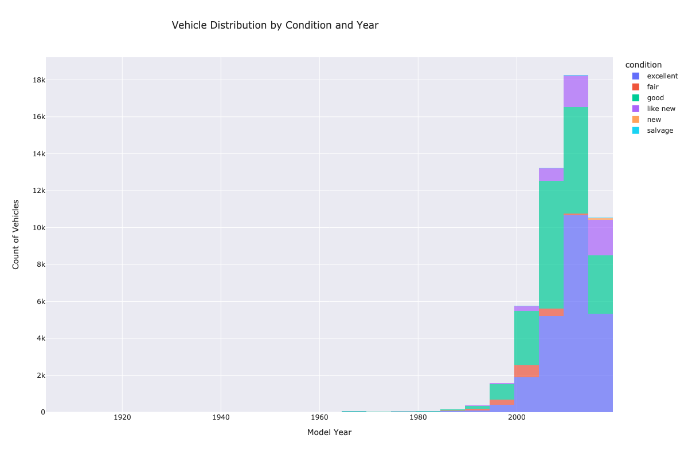
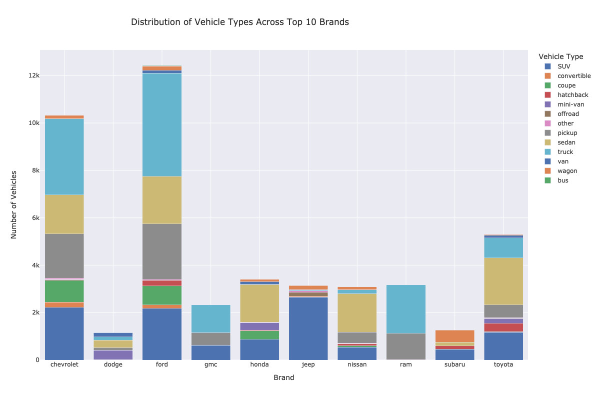

# Vehicle Market Analysis Dashboard

## Overview
An interactive web application analyzing approximately 51,000 vehicle listings in the U.S. market. The project processes and visualizes 13 unique features of vehicle data, providing insights into pricing, conditions, and market trends.

## Key Insights
   - Most vehicles after 2010 are in **excellent condition**.
   - Vehicles from 1995 to 2009 are predominantly in **good condition**.
   - **Cadillac** has the highest average price, while **Volkswagen** has the lowest for vehicles less than 5 years old.
   - **Acura** vehicles have the highest average mileage, while **Nissan** vehicles have the lowest for vehicles under 10 years old.
   - Common colors: **white, black, and silver**.
   - Rare colors: **purple, yellow, and orange**.
   - Rare colors like **yellow** and **orange** command higher prices, likely due to luxury car associations.
   - **Trucks** dominate, showcasing their durability and longevity for vehicles > 200,000 miles.
   - **Toyota**, **Honda**, and **Nissan** are dominated by sedans.
   - **Jeep** focuses on SUVs, while **Ram** specializes in trucks and pickups.
   - A clear **negative correlation** exists across all brands—higher mileage results in lower prices.

## Technologies Used
- Python 3.10.12
- Pandas 2.2.0
- Streamlit 1.41.1
- Plotly Express 5.21.0
- Altair 5.5.0

## Key Visualizations

### Vehicle Condition Distribution Across Years

### Distribution of Vehicle Types Across Top Brands

## Installation and Setup

1. **Clone the repository**
     git clone https://github.com/ashokvin77/Car_advertisement.git

2. **Create and activate conda environment**

     conda create -n vehicle_adv python=3.10.12

     conda activate vehicle_adv

3. **Install required packages**

    pip install -r requirements.txt

4. **Run the Streamlit app**

     streamlit run app.py

5. Open the created URL